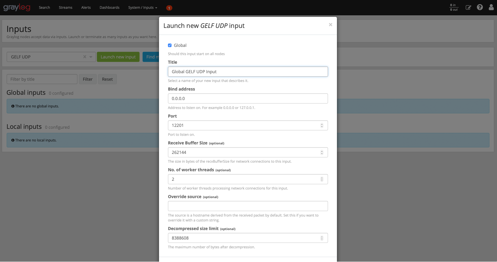
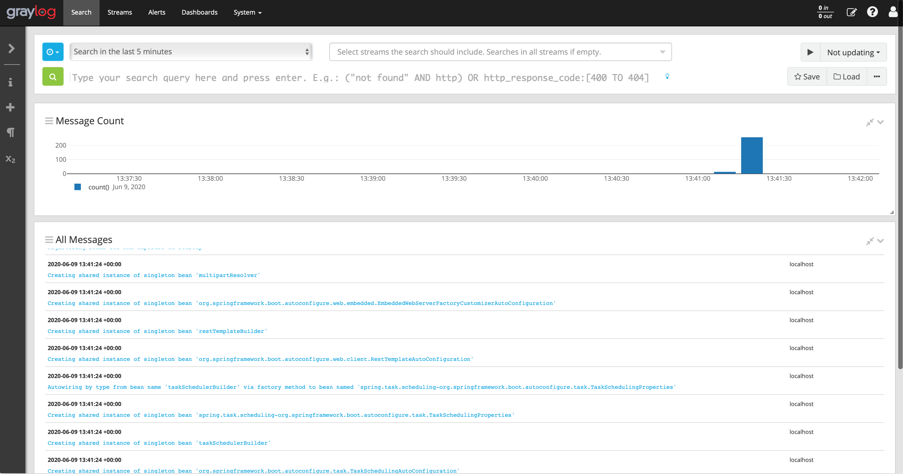

= Rico: Logging appender

This example shows how the logging appender of Rico can be used to add useful metadata to application logging.
Next to this the sample shows how application logging can be stored in a central place.

Rico provides logging appenders for log4j2 and logback.
By using such appender all context information of Rico (see `dev.rico.core.context.ContextManager` for more information) will automatically be added to each log message.

== Centralized logging

When having several applications and services in production the monitoring can become quite complexe.
By providing a centralized log management that stores all logs and provides analytic functionalities developers and administrators can find problems more easily.

image::.readme/central-log.svg[]

In this sample 2 different tools (ELK stack & Graylog) can be used to provide a centralized log management.
For both stacks you can find predefined docker-compose setups that can be used to easily start a running environment.
While each user can choose what tool he wants to test you can never start both of the provided setups since this would end in a port conflict.

Next to storing logging a log management provides much more functionallity.
One important aspect is the support of custom fields / tags that can be used to analyze logging.
The Rico context API provides an easy way to add metadata to an application and by using the Rico logging-appenders such metadata will automatically be added to log informations.
Next to this the GELF standard is used in this sample to send the logging over an UDP connection to the used log manager.

image::.readme/logging-appender.svg[]

=== Using the Graylog stack

The sample provides docker containers to easily start a preconfigured Graylog instance that can will be used to store the logging.
The complete setup can be found in the `docker-graylog` folder of the logging sample.
The `docker-compose` tool is needed to run the sample.
If `docker-compose` is installed on your system you only need to execute the `start.sh` from `docker-graylog` folder to boot the graylog instance.
Once this is done the web ui of Graylog can be accessed at http://localhost:9000[http://localhost:9000].
When opening the ui for the first time you need to login to Graylog (user: admin - passwort: admin).

TODO: Short Description of the Graylog ui

TODO: Define GELF Input in Graylog

Once Graylog is started the 2 Spring Boot application that are part of the sample can be started.
Go to the `server-spring-log4j` or `server-spring-logback` subfolder and use maven to start the server:
`mvn spring-boot:run`

The server application will send the complete logging to the Graylog server by using the GELF format.
In Graylog you can inspect the application logging and see all the Rico context based metadata that is part of each logging message.

The server applications both provide a http endpoint that can be called to create additional logging.
To call the endpoint just open http://localhost:8080/api/sample[http://localhost:8080/api/sample].

=== Using the ELK stack

TODO: documentation for ELK stack

== Log4J, Logback or SLF4J

TODO: Some information about the logging frameworks that are used in the sample and why we decided to use such APIs / setup.
