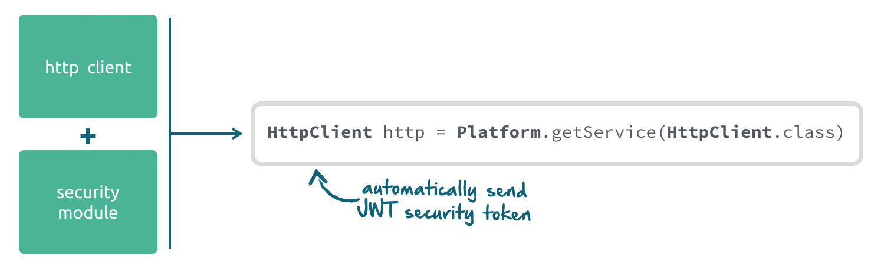

= Rico: Security Sample Application

These example show how the security APIs of Rico can be used. The clients of this sample simply do a login against the server and call a secure REST endpoint on the server.

=== How is the security working?

Rico uses link:https://www.keycloak.org/[Keycloak] for identity and access management. By adding the rico-security-server module to the server application a proxy servlet will be added to the server that provides login functionality by calling the Keycloak server internally.

image::.readme/keycloak.png[]

The security is based on OpenID connect and JWT tokens. Once a client is logged in, it will receive a JWT security token. The HTTP client of Rico automatically adds this token to any request against the server. By doing so, secured endpoints can be called without any additional security handling after a successful login.



The server receives the security token and automatically validates it against the Keycloak server.

== Prerequisites

You need to have the following things installed:

* an Java SDK (tested with Java 8)
* Maven
* Docker (and docker-compose)

== How to run

First, you need to have everthing compiled, so please run `mvn install` in the root directory of this samples project.

To use the security features a Keycloak instance must be configured and started.
The easiest way is to use the docker based Keycloak container that is provided
as part of this sample. If you have installed Docker on your machine everything
else that is needed to start an automatically configured Keycloak server can
be found in the `keycloak-container` folder of this sample.

The folder contains several scripts that can be used to the build, start & remove the Keycloak docker container. To run the scripts docker (and docker-compose) must be installed locally. The folder contains 2 scripts:

* `clearDocker` - This script removes the container from your local docker registry. The script can be used to clear everything if you do not want to use the keycloak container anymore.

* `restart` -  This script stops and removes the keycloak docker container if it is present. After that the container is created and started.

Once you have checked out the repository you only need to call the restart script from the keycloak-container folder and the docker container will be created and started. Since this will download keycloak and do several configuration steps this can take some minutes. The server is up and running once you see the following message in the log:

```
Keycloak 3.4.0.Final (WildFly Core 3.0.1.Final) started in 14189ms - Started 523 of 845 services (568 services are lazy, passive or on-demand)
```

=== Start a Server

Go to the 'server-spring' subfolder and use maven to start the server:

`mvn spring-boot:run`

=== Start a client

==== Java client

To start the JavaFX client simply run `mvn jfx:run` from the client-javafx folder.
Next to this the client can be started by the dev.rico.samples.security.Client class.

==== Plan JavaScript client

Jetty-Maven-Plugin is preconfigured to serve the client, just start

```
mvn jetty:run
```

After this, you can access the sample via `http://localhost:8082`

==== Polymer

Jetty-Maven-Plugin is preconfigured to serve the client, just start

```
mvn jetty:run
```

After this, you can access the sample via `http://localhost:8082`

