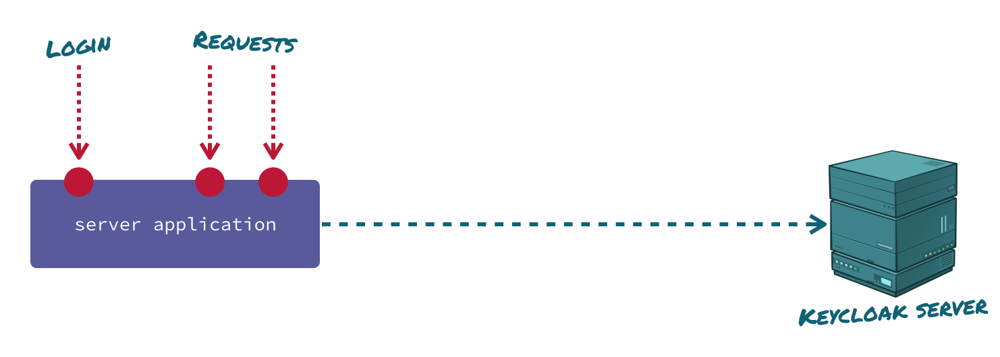

<p align="right">
<a href="http://www.canoo.com"></a>
</p>

# Security sample

These examples show how the security APIs of Dolphin Platform can be used. Since These samples concentrates on
the usage of that security API they do not contain any dynamic clients. The provided clients simply do a login
against the server and call a secure REST endpoint on the server.

## How is the security implemented?

The Dolphin Platform uses [Keycloak](https://www.keycloak.org) for identity and access management. By adding
the `dolphin-platform-security-server` module to the server application a proxy servlet will be added
to the server that provides login functionality by calling the Keycloak server internally.



The security is based on OpenID connect and JWT tokens. Once a client is logged in, it will receive a JWT security
token. The HTTP client of the Dolphin Platform automatically adds this token to any request against the server.
By doing so, secured endpoints can be called without any additional security handling after a successful login.


The server receives the security token and automatically validates it against the Keycloak server.

## Start the sample

As said the sample uses keycloak for for identity and access management. Based on that a keycloak instance
is needed to run the sample. The `keycloak-container` folder contains a [docker](https://www.docker.com) container that can easily be used to run the sample.

### Keycloak docker container
The `keycloak-container` folder contains several scripts that can be used to the build, start & remove the
Keycloak docker container. To run the scripts docker (and docker-compose) must be installed locally. The folder contains 2 scripts:
- `clearDocker`: This script removes the container from your local docker registry. The script can be used
to clear everything if you do not want to use the keycloak container anymore.
- `restart`: This script stops and removes the keycloak docker container if it is present. After that the container
is created and started.

Once you have checked out the repository you only need to call the `restart` script from the `keycloak-container` folder and the docker container will be created and started. Since this will download keycloak and do several configuration steps this can take some minutes. The server is up and running once you see the following message in the log:

```
Keycloak 3.4.0.Final (WildFly Core 3.0.1.Final) started in 14189ms - Started 523 of 845 services (568 services are lazy, passive or on-demand)
```

### Spring Boot server
To start the Spring Boot server simply run `mvn spring-boot:run` from the `server-spring` folder. Next to this the
server can be started by the `com.canoo.platform.samples.security.Server` class.

### JavaFX client
To start the JavaFX client simply run `mvn jfx:run` from the `client-javafx` folder. Next to this the client can be
started by the `com.canoo.platform.samples.security.Client` class.

### JavaScript client
To start the JavaScript client simply run `mvn jetty:run` from the `client-javascript` folder.
The client will be available in your Browser at `http://localhost:8082/`. 

### Polymer client
To start the Polymer client simply run `mvn jetty:run` from the `client-polymer` folder.
The client will be available in your Browser at `http://localhost:8082/`.

## License
The project is released as open source under the [Apache License Version 2.0](http://www.apache.org/licenses/LICENSE-2.0)

<br/><br/>
<p align="center">
<sub>About Canoo</sub>
</p>
<p align="center">
<a title="Canoo Website" href="http://www.canoo.com/"></a>
<a title="Canoo at Twitter" href="https://twitter.com/canoo"></a>
<a title="Canoo at LinkedIn" href="https://www.linkedin.com/company/canoo-engineering-ag"></a>
<a title="Canoo at Xing" href="https://www.xing.com/companies/canooengineeringag"></a>
<a title="Canoo at YouTube" href="https://www.youtube.com/user/canoovideo"></a>
<a title="Canoo at GitHub" href="https://github.com/canoo"></a>
<a title="Contact Canoo" href="mailto:info@canoo.com"></a>
</p>
