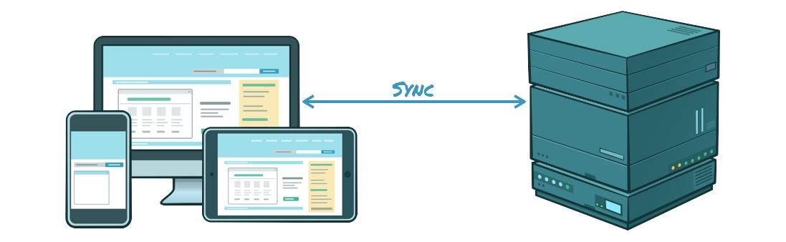
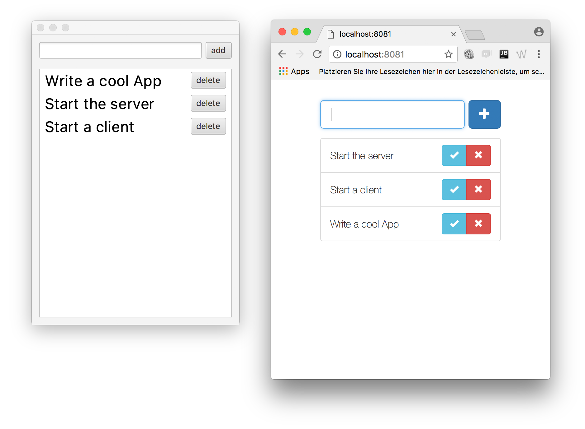
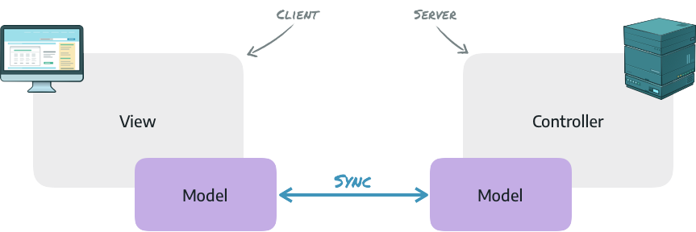
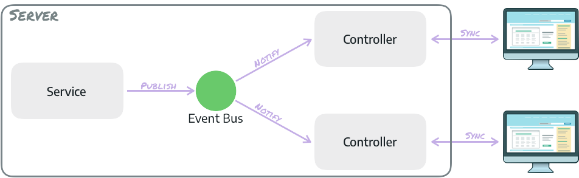

= Rico: Todo List Sample Application

This example contains a todo list that can be shared between several clients.
The sample is based on the remoting modules of rico. The remoting API can be used to synchronize data
between client and server.



The application provides several clients for the todo app that are all connected to the same server instance.
Whenever a todo item is added by one client it will automatically be shown by all other clients.



=== How is the sync between clients implemented?

This sample is based on top of the rico remoting modules. The remoting modules implements
the remote presentation model pattern that provides a automatically synchronization
between client and server. Thus, you don't need to think about any specific
endpoints or requests.



Based on this, the remoting layer defines server side controllers that contain all
the controller logic for a specific view. The lifecycle of these controllers is
automatically synchronized with the view lifecycle. With this approach you have a
MVC group for each client view with a synchronized model and a managed controller.

To share data between different clients the remoting event bus is used.
This event bus can be used to notify controllers. A controller can simply
subscribe itself to any topic and will be notified once an event for that
topic is fired.




In this sample each controller simply calls a service once an item
is added in the view. This service will fire an event to the event bus
and since all controllers are subscribed to the event the new item will
be shown on each client.

== Prerequisites

You need to have the following things installed:

* an Java SDK (tested with Java 8)
* Maven

== How to run

First, you need to have everthing compiled, so
please run `mvn install` in the root directory of this samples project.

Before starting any client at least 1 server must be started. Since the
spring and the JavaEE server both use the same port you can not
start both servers in parallel.

=== Start a Server

==== Spring

Go to the 'server-spring' subfolder and use maven to start the server:

`mvn spring-boot:run` 

==== Java EE

To start the JavaEE server simply run `mvn wildfly:run` from the server-javaee
folder.

Next to this the server can be deployed to any JavaEE 6
application server. To do so run `mvn verify` from the server-javaee
folder. The created `todo-app.war` in the target folder can be
deployed as JavaEE web application. In that case the application must be
reachable under `http://localhost:8080/todo-app`.

=== Start a client


==== JavaFx

To start the JavaFX client simply run `mvn jfx:run` from the
client-javafx folder. Next to this the client can be started
by the dev.rico.samples.todo.client.ToDoClient class.

==== AngularJS

Jetty-Maven-Plugin is preconfigured to serve the client, just start

```
mvn jetty:run
```

After this, you can access the sample via `http://localhost:8081`

==== Polymer

Jetty-Maven-Plugin is preconfigured to serve the client, just start

```
mvn jetty:run
```

After this, you can access the sample via `http://localhost:8082`

