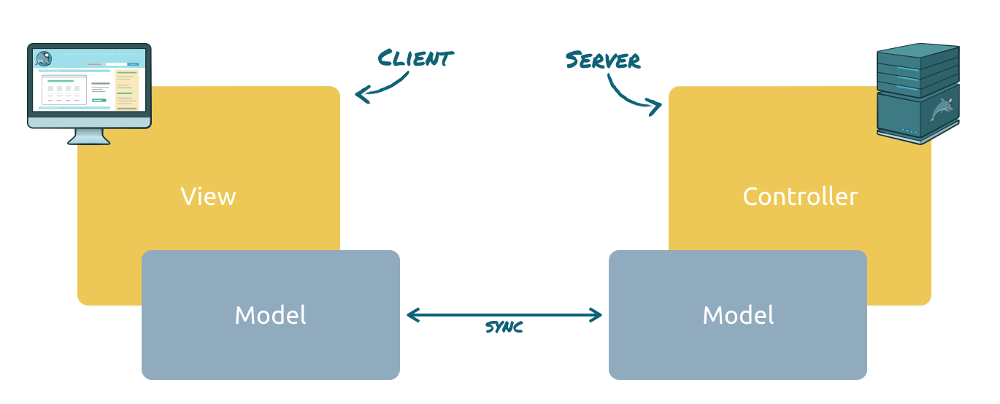
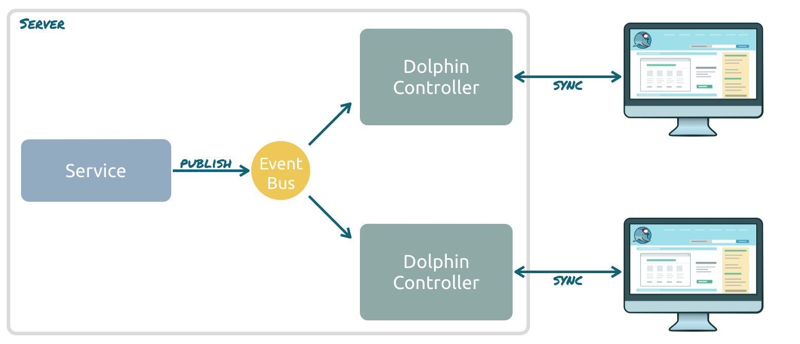

# ToDo List sample

This example contains a todo list that is shared between several clients. The sample is based on the `remoting` modules
of [Dolphin Platform](https://github.com/canoo/dolphin-platform). By doing so data can easily synchronized between
client and server.

The application provides several clients for the todo app that are all connected to the same server instance. Whenever a
todo item is added by one client it will automatically be shown by all other clients.

## How is the sync between clients implemented?

This sample is based on top of the Dolphin Platform remoting layer. This API implements the remote presentation model
pattern. In the remoting layer, all models will automatically be synchronized between client and server. Thus, you don't need to think about any specific endpoints or requests.

Based on this, the remoting layer defines server side controllers that contain all the controller logic for a specific view. The lifecycle of these controllers is automatically synchronized with the view lifecycle. With this approach you have a MVC group for each client view with a synchronized model and a managed controller.

To share data between different clients the remoting event bus is used. This event bus can be used to notify remoting
controllers. A controller can simply subscribe itself to any topic and will be notified once an event for that topic is
fired. Since subscription can only be done in the remoting lifecycle (in a remoting controller), any service can send
an event to the eventbus. By doing so several views can easy be updated based on a service call or even the call of an rest endpoint.

In this sample each controller simply calls a general service once an item is added in the view. This service will fire
an event to the eventbus and since all remoting controllers are subscribed to the event the new item will be shown on
each client.

## Modules

The sample is seperated in several modules. The following image shows the dependecies of the modules:

For all Java modules the model of the application is defined in the `common` module. By doing so the module definition
can easily be shared between client and server modules. The `server-base` module contains all classes that are "server
framework agnostic" and can easily be used in JavaEE and Spring.

## Start the sample

The sample provide a JavaEE and a Spring based server. Only one of the servers can be started since both use the
same port. The server provides the application at `http://localhost:8080/todo-app`.

Once a server is running multiple instances of the clients can be started. All clients connect to a server at
 `http://localhost:8080/todo-app`.

All modules provide a Maven target to start the application.

### JavaEE server
To start the JavaEE server simply run `mvn wildfly:run` from the `server-javaee` folder. Next to this the server can
be deployed to any JavaEE 6 application server. To do so run `mvn verify` from the `server-javaee` folder. The created
`todo-app.war` in the `target` folder can be deployed as JavaEE web application. The application must be reachable
under `http://localhost:8080/todo-app`.

### Spring Boot server
To start the Spring Boot server simply run `mvn spring-boot:run` from the `server-spring` folder. Next to this the
server can be started by the `com.canoo.dolphin.todo.server.ToDoServer` class.

### JavaFX client
To start the JavaFX client simply run `mvn jfx:run` from the `client-javafx` folder. Next to this the client can be
started by the `com.canoo.dolphin.todo.client.ToDoClient` class.

### Angular client
To start the Angular client simply run `mvn jetty:run` from the `client-angular` folder. Once this is done the client
can be reached at `http://localhost:8081`. Just open this url in any web browser.

By calling `mvn jetty:run` the following will happen:

* NPM will be installed locally in the module folder.
* `npm install` will be called in the folder. By doing so NPM will install bower
* `bower install` will be called in the folder. This will download all needed dependencies for the client.
* A Jetty instance will be started. This will host the client at `http://localhost:8081`

### Polymer client
To start the Polymer client simply run `mvn jetty:run` from the `client-polymer` folder. Once this is done the client
can be reached at `http://localhost:8082`. Just open this url in any web browser.

By calling `mvn jetty:run` the following will happen:

* NPM will be installed locally in the module folder.
* `npm install` will be called in the folder. By doing so NPM will install bower
* `bower install` will be called in the folder. This will download all needed dependencies for the client.
* A Jetty instance will be started. This will host the client at `http://localhost:8082`

## License
The project is released as open source under the [Apache License Version 2.0](http://www.apache.org/licenses/LICENSE-2.0)

  

About Canoo

